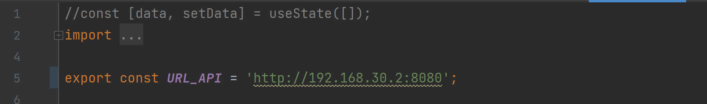
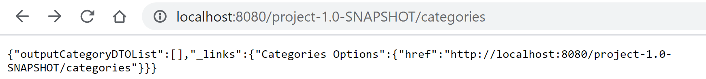

# Personal Finance Project

# Track 4 - Gradle local smoke test of App with Docker Containers

In order to complete this task there are some requirements we need to achieve.

Here's the general guidelines for this Track:

### 1. Build Tools

Gradle will be the build tool in this Track.

### 2. Hosts:

There will be 4 different hosts utilized in this assignment.

**2.1 Control Host**

A Virtual Machine where Jenkins will be installed and running.  
This VM will control all the pipeline.

**2.2 Front End Host**

A Docker container will be used to host the Front End part of our Application.

**2.3 Back End Host**  
A Docker container will be used to host the Back End part of our Application.

**2.4 Database Host**  
A Docker container will be used to host the Database part of our Application.

### 3. Pipeline

The Pipeline for this task should be composed by at least the following stages and tasks:

**3.1 Assemble the application**

**3.2 Generate and publish Javadoc in Jenkins**

**3.3 Run the Tests (Unit and Integration) and publish the results including code coverage**

**3.4 Publish the distributable artifacts in Jenkins**

As we have to use Docker Containers in track 4 we'll also have a stage where we'll build and publish the Docker
Containers

Now let's get to the real work.

# 4. Create the Control Host (VM) using Vagrant

**4.1** Let's edit a Vagrantfile in order to create an Ubuntu VM to run Jenkins and host the code to run the Pipeline.

````groovy
Vagrant.configure("2") do | config |
        config.vm.box = "generic/ubuntu1804"

config.vm.network "private_network", ip: "192.168.30.30"
config.vm.network "forwarded_port", guest: 8080, host: 8080

config.vm.provider "virtualbox" do | vb |

        vb.gui = false
vb.cpus = 4
vb.memory = "8192"
end

config.vm.provision "shell", inline: << -SHELL
sudo apt - get update -y
sudo apt - get install iputils - ping - y
sudo apt - get install -y avahi -daemon libnss -mdns
sudo apt - get install -y unzip
sudo apt - get install openjdk - 8 - jdk - headless - y
# ifconfig
SHELL

end

end
````

Now we open a command line in the location of the Vagrant File and type vagrant up.


After finishing the process, let's use _vagrant ssh_ to login to our new VM.

We could say:


**4.2.** Install Jenkins in the VM (tutorial: https://pkg.jenkins.io/debian/ complemented
by https://phoenixnap.com/kb/install-jenkins-ubuntu)

In the VM command line let's type:

````
wget -q -O - https://pkg.jenkins.io/debian/jenkins.io.key | sudo apt-key add -
````

Now edit the _/etc/apt/sources.list_

````
sudo nano /etc/apt/sources.list
````

Adding the following line:

````
#  Jenkins software repository
deb https://pkg.jenkins.io/debian binary/
````


Now, let's install Jenkins:

_sudo apt update_

_sudo apt install jenkins_

We can verify the installation using _sudo systemctl status jenkins_


Now let's open it through our defined IP (Vagrantfile):

_192.168.30.30:8080_


(To reach this directory you have to use the ye old trick of using a _sudo chmod u+rwx secrets_ or else you can't access
the initial password)


All it's working!

# 5. Create a Gradle build of the project

Since we've been working with Maven in our Project, and for this track we'll need Gradle, there's the necessity to
convert into a Gradle project.

So, let's go into the root of the project and execute the conversion.

Afterwards let's try to create a Gradle Wrapper.

In the end we'll commit and push those files to the repository in order to make them available later on for the Jenkins
stages.

Let's go to the project root folder and type _gradle init_


This will convert the existing Maven project into a Gradle project.


There it is!

Build.gradle, a gradle wrapper,...

Everything seems to be here!

## Note

Well, we had some serious issues in the Build. The conversion from Maven didn't go as expected. We had many issues with
the build not recognizing symbols such as _._ in invoked methods.

It was a generalized problem in the group and even on other groups. We actually made it work by creating a new project
in Spring Boot Initializer copying the Maven dependencies of our project and then adding our code to that project.

It helped and was the only workaround we manage to use with success (We even asked for the professor's help which
suggested this approach).

# 6. Jenkins Pipeline

Now that we have the necessary tools to execute Gradle tasks let's configure our Jenkins pipeline.

Run the VM and open Jenkins using the _192.168.30.30:8080_ url.

Create a new Pipeline and define it to use SCM.

Now let's edit the Jenkinsfile and commit and push that to the repository.

First draft:

````groovy
pipeline {
    agent any

    stages {
        stage('Checkout') {
            steps {
                echo 'Checking out...'
                git 'https://bitbucket.org/RicardoNogueira0025/switch_2020_g3_devops/src/track4/'
            }
        }
        stage('Assemble') {
            steps {
                echo 'Assembling...'
                sh './gradlew clean assemble'
            }
        }

        stage('Tests') {
            steps {
                echo 'Testing...'
                sh './gradlew test'
                junit '**/*.xml'
            }
        }

        stage('Javadoc') {
            steps {
                echo 'Generating Javadoc'
                sh './gradlew javadoc'
                javadoc javadocDir: 'build/docs/javadoc', keepAll: false
                publishHTML([allowMissing: false, alwaysLinkToLastBuild: false, keepAll: false,
                             reportDir   : 'build/docs/javadoc', reportFiles: 'index.html', reportName: 'Generated Javadoc', reportTitles: 'Generated Javadoc'])
            }
        }

        stage('Archiving') {
            steps {
                echo 'Archiving...'
                archiveArtifacts 'build/libs/*'
            }
        }
    }
}
````

Let's not forget to install the necessary plugins in Jenkins (Javadoc, Html Publisher, Docker Pipeline,...)

We ran Jenkins but had an issue because when it tried to build the application, there was a conflict between Jenkins and
SpringBoot due to the predefined port for both being the same (8080). So we changed the definitions of Jenkins in order
to run it from 8082:


We found the war file, gave it execution permission and then ran it through the 8082 port.

There's actually a permanent fix.

To define the Jenkins Port to always be 8082, I went to /etc/default/jenkins and edited it to:


(To edit the file you have to use _sudo_ before running the text editor)


Now we had our first error! We forgot this repository is private so we added some credentials to Jenkins (in order for it to allow access to the repository - https://www.jenkins.io/doc/book/using/using-credentials/)

## Note 2

We had MANY issues regarding Jenkins in the VM.

After many iterations it was failing in a cache module load. I've removed the cached files but not even this worked.

There was some issue with the workspace because when I used the same Jenkinsfile and same Repository and Branch
recurring to my own pc (localhost) the build was successful. (In the VM the build failed more than 30 times...)


So, the solution was to remove Jenkins and all associated files in the VM, then installed Jenkins again and the
respective plugins, and voilá.


Current Jenkinsfile:

````groovy
pipeline {
    agent any

    stages {
        stage('Checkout') {
            steps {
                echo 'Checking out...'
                git credentialsId: 'devops-track4', url: 'https://bitbucket.org/RicardoNogueira0025/switch_2020_g3_devops/src/track4'
            }
        }
        stage('Assemble') {
            steps {
                echo 'Assembling...'
                dir('DEVOPS/Track 4') {
                    sh 'chmod a+x gradlew'
                    sh './gradlew clean assemble'
                }
            }
        }

        stage('Tests') {
            steps {
                echo 'Testing...'
                dir('DEVOPS/Track 4') {
                    sh './gradlew test'
                    junit '**/*.xml'
                }
            }
        }

        stage('Javadoc') {
            steps {
                echo 'Generating Javadoc'
                dir('DEVOPS/Track 4') {
                    sh './gradlew javadoc'
                    javadoc javadocDir: 'build/docs/javadoc', keepAll: false
                    publishHTML([allowMissing: false, alwaysLinkToLastBuild: false, keepAll: false,
                                 reportDir   : 'build/docs/javadoc', reportFiles: 'index.html', reportName: 'Generated Javadoc', reportTitles: 'Generated Javadoc'])
                }
            }
        }

        stage('Archiving') {
            steps {
                echo 'Archiving...'
                dir('DEVOPS/Track 4') {
                    archiveArtifacts 'build/libs/*'
                }
            }
        }
    }
}
````

Let's add a step to run the test coverage and publish the results:

````groovy
        stage('Tests') {
    steps {
        echo 'Testing...'
        dir('DEVOPS/Track 4') {
            sh './gradlew test'
            junit '**/*.xml'
            sh './gradlew test jacocoTestReport'
        }
        step([$class          : 'JacocoPublisher',
              execPattern     : '**/build/jacoco/*.exec',
              classPattern    : '**/build/classes',
              sourcePattern   : 'src/main/java',
              exclusionPattern: 'src/test*'
        ])
    }
}
````

Let's run the build again:


It's failing! Something with the jacocoTestReport!

Let's add something to the build.gradle in order to define the jacoco task:

````groovy
jacoco {
    toolVersion = "0.8.5"
}

test {
    finalizedBy(jacocoTestReport)
}

jacocoTestReport {
    dependsOn test
}
````

Commit and push and let's try again:


To reach this step we had many difficulties. Long story short, Jenkins is not going directly to the branch's defined
folder to find the build.gradle.

It goes to the branch but looks in the build.gradle that's in the entire project's root and not **my specific project
root** in the DEVOPS/Track 4 folder.

This is causing issues with finding tasks and certain configurations. So, in order to try and minimize this issues I'm
going to change the build.gradle inside the folder and copy it to the root project in my branch!

So, the previous code block defining the jacocoTestReport was not needed. All we needed to do was ad the _id 'jacoco'_
to the root build.gradle file.

### EDIT: Please check the end of this tutorial.

### The Branch problem was solved later!

# 6.1 Docker Containers

Now that we have the "main" part of the Pipeline, let's continue.

We'll prepare three containers and define the Pipeline to build these containers and later publish them on Docker Hub.

We'll use 3 Docker Containers, so this means 3 Dockerfiles:

#### Front End Container

#### Back End Container

#### Database Container

# 6.1.1 Frontend Container

For the Frontend Container we'll need to compile the Frontend part of the project. For this we'll need Node.

So we're going to install Node in our VM. This way, we'll add a Stage to the Pipeline where Jenkins will run some
commands in order to build the frontend part and then we'll deliver the build product to a Docker Container.

Let's login with _vagrant ssh_ in our VM and install node using the following commands:

````
curl -sL https://deb.nodesource.com/setup_16.x | sudo -E bash - sudo apt-get -y install nodejs
````

Let's add a Front End Assemble Stage in our Jenkinsfile and make it run npm commands to build the Front End part of our
Application:

````groovy
    stage('Assemble Frontend') {
    steps {
        echo 'Assembling Frontend...'
        dir('DEVOPS/Track 4/frontend') {
            sh 'npm install'
            sh 'CI=false npm run build'
        }
    }
}
````

It's working!


I went to Jenkins and looked in the Workspace to verify the artifacts from the Front End Assemble Stage.

There are many files that should also be in the archiving Stage!

So, I'm switching the order of the Stages in order to assemble the Frontend and after that, archive all necessary
artifacts (Back End and Front End).

We can now see the Front End build artifacts correctly archived.


We also need to install Docker in our VM and make sure it's running.

For that, we'll use the following commands:

````
 sudo apt-get update
 sudo apt-get -y install docker.io
 sudo systemctl enable docker.service
````

This will install docker engine and enable the service to become _always on_ upon running the VM.

It's installed, so let's see if it's running:

_sudo systemctl status docker_


It is!

Now, let's create a Front End Dockerfile:

````dockerfile
FROM ubuntu

RUN apt-get update && \
  apt-get install unzip -y && \
  apt-get install wget -y && \
  apt-get install apache2 -y

ADD /DEVOPS/Track4/frontend/build/ /var/www/html/

EXPOSE 8083
````

We're installing Apache Web Server in this Container and copying the Front End build products to the necessary folder.

Now let's add a stage to Jenkinsfile to build a Docker Image:

````groovy
        stage('Build Docker Image') {
    steps {
        echo 'Building Docker Images'
        dir('DEVOPS/Track 4/Frontend_Docker') {
            script {
                frontend_image:
                docker.build("titipipers/frontend_image:${env.BUILD_ID}")
                frontend_image.push()
            }
        }
    }
}
````

Let's commit and push and try to run the Pipeline.

Ups...something wrong...20 minutes and no build??

Something about "select your geographical area" in the Front End Docker build.

Luckily our friends in the Internet helped us solve this:

````dockerfile
apt-get install -y tzdata
````

Just add this line to our Dockerfile.

Aaaaaaan another error...I gave it the wrong path (oh dear oh dear...)

Moved it to the frontend folder correcting the line:

````dockerfile
ADD build/ /var/www/html/
````

Build failed again! Permission denied in Docker Hub push!

So, we went to Jenkins and added some credentials regarding Docker Hub account (The same way we added credentials to the Git repository and defined them in our Pipeline) and then place them in the Jenkinsfile:

````groovy
       stage('Build Docker Image') {
    steps {
        echo 'Building Docker Images'
        dir('DEVOPS/Track 4/frontend') {
            script {
                docker.withRegistry('', 'docker-credentials')
                frontend_image = docker.build("titipipers/frontend_image:${env.BUILD_ID}")
                frontend_image.push()
            }
        }
    }
}
````

We have to configure the Jenkins Pipeline in order to access this credentials.


# 6.1.2 Back End Container

For the Back End Container we'll be simplifying the proccess.

We'll use a tomcat-based container and add the war file to it. It is already built from the assemble stage, so let's
take profit from that:

````dockerfile
FROM tomcat

RUN apt-get update -y

RUN apt-get install -f

ADD /build/libs/*.war /usr/local/tomcat/webapps/

EXPOSE 8080
````

Now let's update the Jenkinsfile to add this step to our pipeline:

````groovy
        stage('Build Docker Image') {
    steps {
        echo 'Building Front End Docker Image'
        dir('DEVOPS/Track 4/frontend') {
            script {
                docker.withRegistry('', 'docker-credentials') {
                    frontend_image = docker.build("titipipers/frontend_image:${env.BUILD_ID}")
                    frontend_image.push()
                }
            }
        }
        echo 'Building Back End Docker Image'
        dir('DEVOPS/Track 4') {
            script {
                docker.withRegistry('', 'docker-credentials') {
                    backend_image = docker.build("titipipers/backend_image:${env.BUILD_ID}")
                    backend_image.push()
                }
            }
        }
    }
}
````

Commit and push and let's see why it fails (Yeah, I don't have hope nowadays...)

It failed due to missing brackets and a wrong name of the Dockerfile (It doesn't recognize other name than _Dockerfile_)
.

Now, it's working:


### Important Information

After discussing with some of my group members we arrived at the conclusion that the SpringBoot Main class will have to
extend SpringBootServletInitializer in order to work in tomcat:

````java
public class FFMSpringBootApplication extends SpringBootServletInitializer {}
````

and we also have to add the tomcat dependency to the _build.gradle_ file.

````groovy
providedRuntime 'org.springframework.boot:spring-boot-starter-tomcat'
````

One other thing to worry about is the different _application.properties_ profiles.

In our project we have two different application properties environments. One is for "Test" (Which means development
environment) and one for "Prod" regarding Production Environment.

So, in our Jenkins Pipeline in order to run the tests using SpringBoot and our BootStrap we'll utilize _Test_
environment (which is selected by default).

But, after we finish the Pipeline we want the Docker Container to be prepared to run on _Production_ Environment,
because we're going to use a Database that works with Persistence instead of Memory. So in order to work, SpringBoot
cannot run in _Test_ environment.

This means we'll use the Path Variable defined in application.properties and we're going to set it to a _Prod_ value in
our Backend Container

This is our app properties active profile:

````properties
spring.profiles.active=${APP_PROFILE:test}
````

In the Backend Container it will be changed to "prod" adding this to the Back End Dockerfile:

````dockerfile
ENV APP_PROFILE=prod
````

This way, when SpringBoot starts to run in our Container it will shift to the "Production" Environment and it will be
redirected to a Database working with Persistence.

# 6.1.3 Database Container

First, and in order to not forget, let's add some info to the _application-prod.properties_ in order to configure the
Database:

````properties
spring.datasource.url=jdbc:h2:tcp://192.168.33.11:9092/./jpadb;DB_CLOSE_DELAY=-1;DB_CLOSE_ON_EXIT=FALSE
spring.datasource.driverClassName=org.h2.Driver
spring.datasource.username=sa
spring.datasource.password=
spring.jpa.database-platform=org.hibernate.dialect.H2Dialect
# So that spring will no drop de database on every execution.
spring.jpa.hibernate.ddl-auto=update
spring.h2.console.enabled=true
spring.h2.console.path=/h2-console
spring.h2.console.settings.web-allow-others=true
````

We'll have to adjust the IP when we decide what IP's each Container will use, as soon as we use Docker Compose.

Database Dockerfile:

````dockerfile
FROM ubuntu

RUN apt-get update && \
  apt-get install -y openjdk-8-jdk-headless && \

RUN wget https://repo1.maven.org/maven2/com/h2database/h2/1.4.200/h2-1.4.200.jar

EXPOSE 8082
EXPOSE 9092

CMD java -cp ./h2-1.4.200.jar org.h2.tools.Server -web -webAllowOthers -tcp -tcpAllowOthers -ifNotExists
````

Let's update the Jenkinsfile:

````groovy
 echo 'Building Database Docker Image'
dir('DEVOPS/Track 4/Database_Docker') {
    script {
        docker.withRegistry('', 'docker-credentials') {
            database_image = docker.build("titipipers/database_image:${env.BUILD_ID}")
            database_image.push()
        }
    }
}
````

Now, the usual. Commit, push and test the Pipeline:

After some small hickups (Wrongfully removed the wget install and was using it in the Dockerfile) we have success:


If we push the image without tag it will, by default, assume as "latest". We removed the tag part of the docker.build()
in the Jenkinsfile stages.

# 7. Local Smoke Test of the Application

Now we're going to run the Docker Compose file in our on machine, to execute the three containers simultaneously in
order to verify if everything is going smoothly.


## 7.1 Docker Compose file

````yaml
version: '3'
services:
  backend:
    image: titipipers/backend_image
    ports:
      - "8080:8080"
    networks:
      default:
        ipv4_address: 192.168.30.32
    depends_on:
      - "db"
  db:
    image: titipipers/database_image
    ports:
      - "8083:8083"
      - "9092:9092"
    networks:
      default:
        ipv4_address: 192.168.30.33
  frontend:
    image: titipipers/frontend_image
    ports:
      - "80:80"
    networks:
      default:
        ipv4_address: 192.168.30.31
networks:
  default:
    ipam:
      driver: default
      config:
        - subnet: 192.168.30.30/24
````

In our Docker Compose we have the three images we've previously created are we'll run them in our machine using:

````
docker compose build
docker compose up
````

The result is this:


First, the DB Container is not being re-directed to the IP Address that was defined in the docker compose file.

Then, for a reason I can't tell, the back end container is trying to connect to a non-defined IP:


One other problem we're having is the Frontend container not initializing:

.

So, let's start the troubleshooting...

One mistake is that the Service.js class is not correctly defined.

The frontend is trying to reach the backend through "localhost:8080". We've changed that to match the IP address from
the Back End Container!

Also, we're changing the network of the Docker Compose in order to not restrict the network as much.

So, instead of subnet 192.168.30.30/24 we've defined 192.168.30.0/24.

Let's change it in the docker-compose and also update the Containers IP:

````yaml
version: '3'
services:
  backend:
    image: titipipers/backend_image
    ports:
      - "8080:8080"
    networks:
      default:
        ipv4_address: 192.168.30.2
    depends_on:
      - "db"
  db:
    image: titipipers/database_image
    ports:
      - "8083:8083"
      - "9092:9092"
    networks:
      default:
        ipv4_address: 192.168.30.3
  frontend:
    image: titipipers/frontend_image
    ports:
      - "80:80"
    networks:
      default:
        ipv4_address: 192.168.30.1
networks:
  default:
    ipam:
      driver: default
      config:
        - subnet: 192.168.30.0/24
````

So, let's first commit and push it to Jenkins, perform a new pipeline run in order to compile the service.js with the
right path:



It builds regularly but it fails when we run the docker compose.

Same issue trying to get the database from a wrong IP:


So, let's first try to look to another Container image for the Backend.

One of my group members had success with a specific image that is also using Java 1.8 istead of Java 11 (My Container is
using Java 11):

````dockerfile
FROM tomcat:8.5.68-jdk8-openjdk

ENV APP_PROFILE=prod

ADD build/libs/project-1.0-SNAPSHOT.war /usr/local/tomcat/webapps/

EXPOSE 8080


# FROM tomcat

# RUN apt-get update -y

#RUN apt-get install -f

#ENV APP_PROFILE=prod

#ADD /build/libs/*.war /usr/local/tomcat/webapps/

#EXPOSE 8080
````

Now let's commit this changes and call Mr. Jenkins to run the Pipeline.

It's working! It recognizes the database! But after a more thorough search I've noticed that the problem was the Local Containers were not being updated, because they were not being fetched from the remote repository.

They were being called locally. This means all changes to the Docker Images were not being used, since the old images were still being accessed in my computer!

I've destroyed the images and made _docker compose up_ and it updated. So, the previous
IP problem was no more!

Now I'm going back to the previous tomcat container to see if it works.

But of course, Mr. Jenkins said:


Corrupted git files!

So, created a new track, using the same Jenkinsfile and Repo/Branch:


Let's try to run the containers again:


Also, success!

It's redirecting to the correct DB!


And it has all the information =):


Great! Now, we still have the Frontend Container issue!


After discussion with some group members I'm going to attempt a different Docker Container.

This time we'll use a pre-existing one which is also working for one of my group members, the Great Tomás Osswald,
best-known for reinventing the "Have you tried shutting down and starting again" and converted it to the "Did you
deleted everything? Did you format your pc? Have you deleted the entire European History?"

So, we've updated the Frontend Dockerfile to the following:

````dockerfile
 #FROM ubuntu

# RUN apt-get update -y && \
#    apt-get install -y tzdata && \
#    apt-get install apache2 -y

# ADD build/ /var/www/html/

# EXPOSE 80

FROM httpd:2.4

COPY build/ /usr/local/apache2/htdocs/
````

So, let's commit and push, new run of the Pipeline, and then docker compose up again and see if it changes everything:


It's not exiting with exit code 0 anymore!


YES!

The frontend part of the application is running!

Now, to the final test!

Let's add something to the Frontend and verify if it is added to the database!

We are having a small issue!

We can't access our Frontend using the Docker Container IP.

We have to use localhost:8080/project-1.0-SNAPSHOT and then we'll manage to achieve something!



But, for this to happen normally, we have to change the Service.js again:


Once again, commit, push, build in the pipeline, run again the Containers.

Now, just go to your browser and type:

````
localhost:80
````


Let's try to create a family:


It looks like it's working!

Let's confirm the Database:


Yes!

# Smoke test completed!

Phew...This was a rough one!

On a final note, there were many edits to the code and files, and they are all mentioned in the Readme, except one. I've
changed the Checkout Stage to include the specific Branch and solve the previous issue with having to edit files in my
branch and also master:

````groovy
    stage('Checkout') {
    steps {
        echo 'Checking out...'
        git branch: 'track4', credentialsId: 'devops-track4', url: 'https://bitbucket.org/RicardoNogueira0025/switch_2020_g3_devops.git'
    }
}
````

This solved that issue and correctly pointed to my branch exclusively!

One other step after the project was completed was a add-on to correct a small issue in Jenkins.

So, when we went to Jenkins and clicked in the "Generated Javadoc" it opened an empty page. But, when we clicked in the top-right corner in _Zip_, it downloaded the correct Javadoc.


When we open the index.html it appears how it should appear in Jenkins:


So, a group member found a solution online and we're going to try it.

We have to change the setings in the Jenkins GUI.

First, let's run our VM and then open Jenkins

Now, let's add _/script_ in the Jenkins url:


And now let's run the following script:

````shell
System.setProperty("hudson.model.DirectoryBrowserSupport.CSP"," ")
````


Let's check the Javadoc. Still the same. So, let's start another build to see if it generates correctly the Javadoc.

We ran the build and...


Success =).


# 8 Analysis of the Alternatives

## 1. Track 4 Analysis

- This track is easy to understand since it is very straightforward in terms of executing changes, commit them and then just run the pipeline to create the necessary Docker Images.

- One limitation we have is having to resort to the Jenkins GUI to run the Pipeline. Everytime we performed a change we always had to go to the Jenkins GUI. It's not very demanding but it is a limitation. Associated with this we always have to have the control host running, everytime we want to run the Pipeline. In some moments, having the Control Host, IDE, multiple containers and the Browser opened, made my computer sweat. And it is a 6 core with 16gb of Ram. So, machines with less processing capacity could have some issues.

- Working with configuration files in the Control Host and Docker is a simple way of creating the necessary hosts. We could even use past images and existing ones, which reduced the search time.

- This track allows for the distribution of the Docker Images and even the Docker Compose in order to reproduce this environment elsewhere, which makes it easy to distribute for the developers, per instance.


### 2. Other Tracks Comparison

- Since the different tracks are grouped, having only the build tool to differentiate them we're going to compare them by pair.


#### Track 3:

- Since the project we're using is actually built on Maven this track would require less modifications in terms of Build Tools.

- Instead of gradle it would be necessary to install Maven in the Control Host.

- Everything else is the same as our track (Track 4)


#### Tracks 1 and 2:

- These tracks would use Ansible to configure all virtual machines.
  
- The main difference is that there would be no Docker usage. With only a Vagrantfile it would be possible to configure all the VM's and then use Ansible to orchestrate all the deploy process.


#### Tracks 5 and 6:

- The major difference to our track is the usage of cloud containers. This means less demand for your computer, because all the processing would be executed in the cloud, externally to your physical machine. Although, this would demand a lot more configuration since you'd have to create the containers and guarantee they are running before deploying to them.

- Control Host still have to be runned locally, and have Jenkins.

- Since they are cloud containers and could be accessed everywhere, it is a good approach for a more distributed deployment.


#### Tracks 7 and 8:

- Still, the control host is local and will have to run Jenkins locally (It can also be used in the cloud).

- As it is everything in cloud containers this will need extra steps in terms of configuration!

- Having Ansible in this solution allows for a more versatile and dynamic approach, since we don't even have to be logged in the servers to execute tasks and Ansible controls everything directly.

- Since this solution is all regarding cloud computing it is less demanding in your local machine and allows for a more distributed version since it is available to everyone.